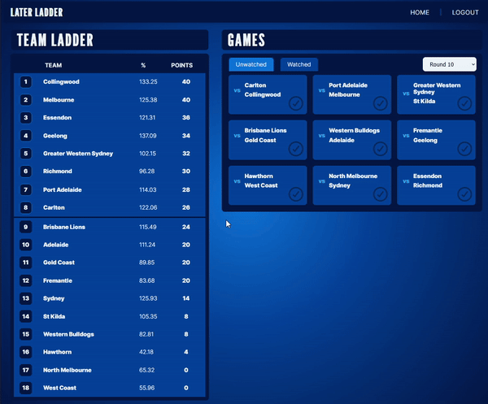

# Later Ladder

As an American fan of the Australian Football League (AFL) and Aussie rules football, one of the challenges I've faced is the inconvenience of checking current team standings without inadvertently spoiling match results that occurred overnight.

Later Ladder offers a solution: to display a team ladder that only refreshes as the user personally marks off the games they've watched. This unique feature ensures that you can stay informed about the current AFL standings while preserving the excitement of each match!

This is a work in progress. 

Status: Core functionality is now complete. Users can mark games as watched or unwatched and the team ladder updates according to those game results. Games do not have to be watched in any particular order.

Features to come:

- Mark all games watched/unwatched up to present
- Mark games watched/unwatched by round
- View game details page for scores and other game statistsics
- View hypothetical ladder by choosing winning team in games not yet completed
- Optimize for mobile viewing
